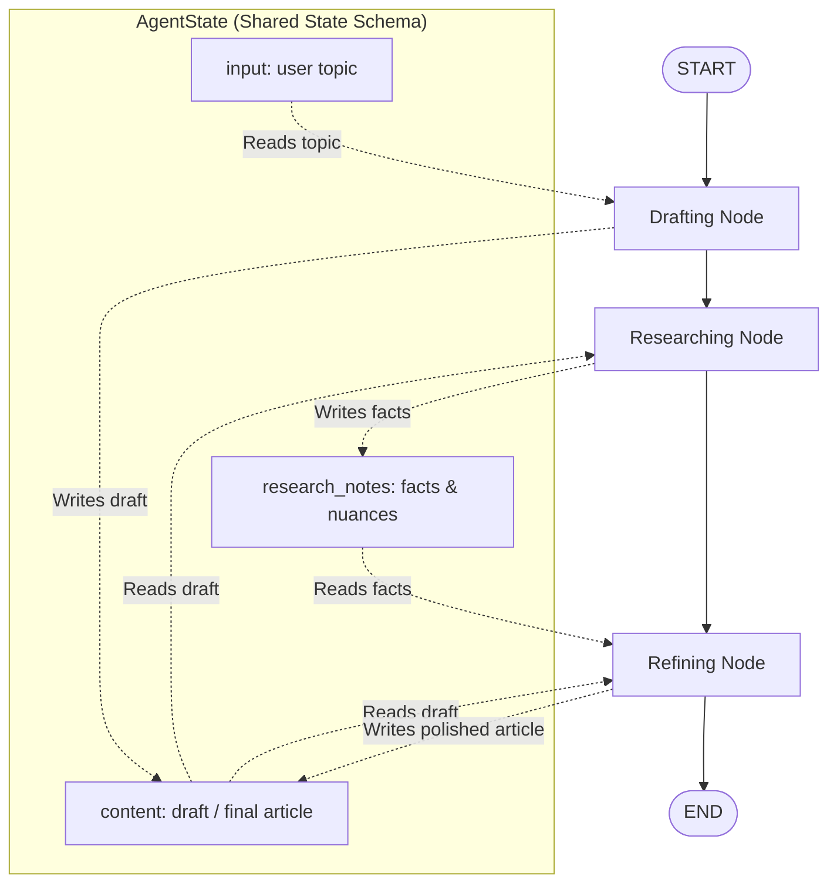

# AI Agent Showcase Project

A demonstration project showcasing a multi-step AI agent powered by **LangChain** and orchestrated via **LangGraph**, built with an **Object-Oriented Programming (OOP)** approach.

## 🚀 Overview
This project demonstrates how to build complex, stateful agentic workflows. Instead of simple linear chains, it uses LangGraph to manage a non-linear \"State Machine\" where the AI moves through different phases:
1.  **Drafting**: Initial creation of content based on user input.
2.  **Researching**: Enhancing the draft with additional facts and depth.
3.  **Refining**: Polishing the final output into a professional format.

## 🛠️ Technologies Used
- **Python**: The core programming language.
- **LangChain**: Provides high-level abstractions for interacting with LLMs.
- **LangGraph**: Manages the agent's state and lifecycle transitions.
- **Pydantic**: Defines structured data models for the internal state.

## 📋 Prerequisites
Before running this project, ensure you have:
- Python 3.9 or higher installed.
- **Ollama** installed and running locally ([ollama.com](https://ollama.com/)).
- The model `gemma4:12b` pulled via Ollama (run `ollama pull gemma4:12b`).

## 🚀 Setup & Installation

1.  **Clone or Navigate to the project directory:**
    ```bash
    cd ai_agent_showcase
    ```

2.  **Create a Virtual Environment (Recommended):**
    ```bash
    python -m venv venv
    source venv/bin/activate # On Windows use: venv\\Scripts\\activate
    ```

3.  **Install Dependencies:**
    ```bash
    pip install -r requirements.txt
    ```

4.  **Configure Environment Variables:**
    Create a file named `.env` in the root directory. While Ollama often uses defaults, you can specify your host if needed:
    ```text
    OLLAMA_HOST=http://localhost:11434
    ```

## 🏃 Running the Project

To start the agent, run the main entry point:
```bash
python main.py
```

The application will prompt you for a topic. The agent will then proceed through its internal graph, outputting status updates as it moves from "Drafting" to "Researching" and finally to "Refining."

## 📊 Workflow & LangGraph Architecture

The project employs a structured graph-based agent architecture using LangGraph. The diagram below illustrates how data and control flow through each node and how the shared state is managed:



### 🔄 Program Flow
1. **Drafting Phase (`drafting_node`)**: Receives the user input topic (`state["input"]`), generates an initial draft outline, and stores it in `state["content"]`.
2. **Researching Phase (`researching_node`)**: Reads the initial draft from `state["content"]`, executes research instructions to generate three contextual nuances/facts, and saves them specifically to `state["research_notes"]`.
3. **Refining Phase (`refining_node`)**: Reads both the initial draft (`state["content"]`) and the research findings (`state["research_notes"]`), merges them into a polished final article, and overwrites `state["content"]` with the refined output.

---

## 💡 Nuances & Importance of LangGraph

Compared to standard linear chains, LangGraph provides key superpowers for agentic development:

1. **Persistent State Management (No Context Loss)**
   In vanilla LLM chains, state is often passed linearly, making it easy to accidentally overwrite critical context. For example, if the research phase returned its notes directly to the main `content` variable, the original draft would be lost. 
   LangGraph uses a central state schema (`AgentState`). When a node returns a dictionary, LangGraph merges it into the state rather than replacing it. By storing research notes in `research_notes` and keeping the draft in `content`, the refining node has access to both.

2. **Decoupled Node Logic**
   Each node in LangGraph is a discrete step that does not need to know where its input came from or where its output is going. Nodes read from the state, execute their logic (using the `AgentEngine`), and write to the state. This makes adding, removing, or re-ordering steps highly modular.

3. **Cycles and Non-Linear Paths**
   While this showcase utilizes a linear flow (`START -> drafting -> researching -> refining -> END`), LangGraph is built to support loops, conditional branches (e.g., repeating the research phase if facts are missing), and human-in-the-loop interventions (e.g., waiting for user approval on a draft before refining).

---

## 🏗️ Architecture Highlights
- **OOP Implementation**: By wrapping LangChain logic inside the `AgentEngine` class, we decouple the LLM logic from the Graph orchestration.
- **State Management**: The `AgentState` object acts as a persistent source of truth that is modified at each node in the graph.
- **Scalability**: Because it uses LangGraph, you can easily add new nodes (e.g., "Fact Check" or "Image Generation") just by adding a new class method and updating the graph edges.

---
*Developed as a demonstration of advanced AI Agent patterns.*
